## 产品概述

在现有纯向量检索（pgvector）基础上，新增 BM25 关键词检索链路。先打通 BM25 的写路径（chunk 分词语法建倒排索引）和读路径（查询分词 → SQL 计算 BM25 分数 → 排序返回），RRF 融合稍后接入。

## 核心功能

- **HanLP 中文分词器**：引入 HanLP portable 便携版，加载自定义技术词典（JUC/JVM/Redis/RocketMQ/Spring 术语），强制使用自定义词典模式。封装为 Spring 单例 Bean，入库和查询共用同一实例
- **BM25 倒排索引**：三张表——`bm25_term_freq`（词频）、`bm25_doc_freq`（词-文档频率）、`bm25_kb_stats`（全局统计）。DF 递增只关心"该 term 是否在该 chunk 中出现过"，与 tf 具体数值无关
- **写入同步**：在 `KnowledgeBaseVectorService.vectorizeAndStore()` 中，chunk 拆分后并行对每个 chunk 做 HanLP 分词 → 统计 tf → 批量写入 term_freq / 更新 df / 更新 kb_stats
- **BM25 检索服务**：新增 `BM25SearchService`，查询时先分词 → SQL 联合三表计算 BM25 分数（k1=1.5, b=0.75）→ 按 chunk_id 分组求和排序 → 返回 top-K
- **删除同步**：删除知识库时同步清理三张 BM25 表，保证索引和向量数据一致性
- **评测验证**：使用现有 `FullEvaluationTest`（4 主题 102 正例 + 21 负例），跑纯 BM25 的 Recall@5 / Precision@5 / NDCG@5 / MRR 指标

## 技术栈

- **分词器**：HanLP portable 1.8.4（`com.hankcs:hanlp:portable-1.8.4`），纯 Java 便携版，无外部依赖，Docker 环境零额外安装
- **数据访问**：`JdbcTemplate` 直接操作 BM25 三张表（与现有 `VectorRepository` 风格一致）
- **表管理**：`@PostConstruct` 中执行 `CREATE TABLE IF NOT EXISTS` SQL（因 JPA ddl-auto=create 可能影响已有数据，BM25 表独立管理更安全）
- **现有依赖**：Java 21 + Spring Boot 4.0 + PostgreSQL + Spring AI PgVectorStore

## 实现方案

### 整体架构

```mermaid
flowchart TB
    subgraph 写入路径
        A[KnowledgeBaseVectorService.vectorizeAndStore] --> B[RecursiveCharacterSplitter]
        B --> C[List of chunk Strings]
        C --> D[向量化 + 写入 vector_store]
        C --> E[BM25 分词 + 写入三张表]
        E --> E1[BM25Tokenizer.tokenize]
        E1 --> E2[统计 tf]
        E2 --> E3[批量 INSERT term_freq]
        E2 --> E4[UPDATE doc_freq df+=1]
        E2 --> E5[UPDATE kb_stats]
    end

    subgraph 读取路径
        F[BM25SearchService.search] --> G[BM25Tokenizer.tokenize query]
        G --> H[SQL: 联表计算 BM25 分数]
        H --> I[GROUP BY chunk_id, ORDER BY score DESC]
        I --> J[Top-K chunk UUID 列表]
    end

    subgraph 删除路径
        K[KnowledgeBaseVectorService.deleteByKnowledgeBaseId]
        K --> L[VectorRepository.deleteByKnowledgeBaseId]
        K --> M[BM25IndexService.deleteAllByKbId]
        M --> M1[DELETE term_freq WHERE kb_id=?]
        M --> M2[UPDATE doc_freq df-=1 for deleted terms]
        M --> M3[UPDATE kb_stats subtract counts]
    end
```



### 数据库表设计

```sql
-- 倒排索引本体：记录每个 chunk 中每个 term 出现几次
CREATE TABLE IF NOT EXISTS bm25_term_freq (
    kb_id       BIGINT NOT NULL,
    chunk_id    VARCHAR(36) NOT NULL,    -- 对应 vector_store.id (UUID)
    term        VARCHAR(64) NOT NULL,
    tf          INT NOT NULL,
    PRIMARY KEY (kb_id, chunk_id, term)
);
CREATE INDEX IF NOT EXISTS idx_bm25_tf_lookup 
    ON bm25_term_freq (kb_id, term);

-- 词-文档频率：某个 term 在多少个 chunk 中出现过
CREATE TABLE IF NOT EXISTS bm25_doc_freq (
    kb_id       BIGINT NOT NULL,
    term        VARCHAR(64) NOT NULL,
    df          INT NOT NULL,
    PRIMARY KEY (kb_id, term)
);

-- 全局统计：所有知识库的总 chunk 数、总 term 数、平均 chunk 长度
CREATE TABLE IF NOT EXISTS bm25_kb_stats (
    kb_id         BIGINT PRIMARY KEY,
    total_chunks  INT NOT NULL DEFAULT 0,
    total_length  BIGINT NOT NULL DEFAULT 0,
    avgdl         NUMERIC(10,4) NOT NULL DEFAULT 0
);
```

### 写路径关键逻辑

```java
// 在 KnowledgeBaseVectorService.vectorizeAndStore() 内，chunk 拆分后：
List<Document> chunks = splitTexts.stream()
    .map(Document::new).collect(Collectors.toList());

// 为每个 chunk 分配 UUID（与 vectorStore.add 后的 id 对应）
chunks.forEach(chunk -> {
    chunk.setId(UUID.randomUUID().toString());
    chunk.getMetadata().put("kb_id", knowledgeBaseId.toString());
});

// 并行建 BM25 索引
bm25IndexService.indexChunks(knowledgeBaseId, chunks);

// 然后走原来的分批向量化：
for (List<Document> batch : partition(chunks, MAX_BATCH_SIZE)) {
    vectorStore.add(batch);
}
```

### BM25 分数计算公式

SQL 实现以下公式（k1=1.5, b=0.75）：

```
对于每个查询词 qi，chunk d 的单项得分：
  IDF(qi)   = LN((N - df + 0.5) / (df + 0.5) + 1)     -- N = 全局总 chunk 数
  TF 归一化  = (tf * (k1 + 1)) / (tf + k1 * (1 - b + b * len / avgdl))
  score(qi,d) = IDF(qi) * TF归一化

最终 BM25(d, query) = SUM(score(qi, d) over all query terms qi)
```

### 删除同步关键逻辑

```java
// BM25IndexService.deleteAllByKbId(kbId)
// 1. 先查出该 kb 下所有 (chunk_id, term) 对
// 2. 遍历每个 term，df -= 1（如果 df 降为 0 则删行）
// 3. DELETE FROM bm25_term_freq WHERE kb_id = ?
// 4. UPDATE kb_stats: total_chunks -= N, total_length -= L, avgdl 重算
```

### 目录结构

```
app/src/main/java/interview/guide/modules/knowledgebase/
├── tokenizer/
│   └── BM25Tokenizer.java          # [NEW] HanLP 分词器封装（Spring Component）
├── bm25/
│   ├── BM25IndexService.java       # [NEW] BM25 索引写入/删除服务
│   ├── BM25SearchService.java      # [NEW] BM25 检索打分服务
│   └── BM25Repository.java         # [NEW] JdbcTemplate 操作三张表
├── service/
│   └── KnowledgeBaseVectorService.java  # [MODIFY] 集成 BM25 写入+删除同步
├── config/
│   └── BM25TableInitializer.java   # [NEW] @PostConstruct 建表
└── repository/
    └── VectorRepository.java        # 不变

app/src/main/resources/
└── dict/
    └── tech-terms.txt              # [NEW] 技术术语词典

app/src/test/java/interview/guide/modules/knowledgebase/evaluation/
└── FullEvaluationTest.java          # [MODIFY] 新增纯 BM25 评测方法
```

## Agent Extensions

### SubAgent

- **code-explorer**
- Purpose: 在计划阶段验证 `KnowledgeBaseVectorService.vectorizeAndStore()` 的完整调用链，确认 chunk 写入 vector_store 前后有两个钩子点可以插入 BM25 索引逻辑（Document.id 在 Spring AI PgVectorStore 中如何生成），以及确认 `KnowledgeBaseEntity` 是否有 `chunkCount` 字段可用于 kb_stats 的初始值引用
- Expected outcome: 明确 chunk UUID 的生成时机（是手动 set 还是 Spring AI 自动生成），确认 BM25 写入应该放在 `vectorStore.add()` 之前还是之后