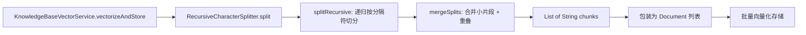

## 产品概述

将知识库文档拆分的底层策略从 Token 级滑动窗口改为递归字符拆分（Recursive Character Splitter），使每个 chunk 在语义上保持完整，提升 RAG 检索的准确性和召回率。

## 核心功能

- **递归字符拆分**：按优先级层级（段落 → 换行 → 句子 → 子句 → 空格 → 逐字符）递归切分文本，最大化保留语义边界
- **合并阶段**：将递归拆分得到的小片段按目标 chunk 大小重新拼接，同时实现相邻 chunk 间的重叠，保证输出 chunk 大小均匀
- **字符计量替代 Token 计量**：chunk 大小从 300 token 改为 500 字符（约等价），overlap 保持 50 字符
- **移除 jtokkit 依赖**：jtokkit 仅用于旧的 Token 级切分，无其他引用，一并移除

## 技术栈

- Java 21 + Spring Boot 4.0
- 不引入新依赖（移除 jtokkit，不新增第三方库）
- 纯字符串操作实现递归拆分

## 实现方案

### 核心策略：递归字符拆分 + 合并两阶段

#### 第一阶段：递归拆分（`splitRecursive`）

按分隔符优先级列表逐级尝试切分：

```
separators = ["\n\n", "\n", "\u3002\uff01\uff1f", "\uff1b\uff0c\u3001", " ", ""]
               段落     换行      。！？            ；，、        空格  兜底
```

递归过程：取当前最高优先级分隔符切分文本 → 对每个片段，若长度 <= chunk_size 则保留，否则递归使用下一优先级分隔符继续切分 → 全部优先级试完后仍超长的片段按 chunk_size 逐字符硬切。

#### 第二阶段：合并拆分片段（`mergeSplits`）

将递归拆分得到的小片段按顺序拼接：

1. 遍历片段列表，逐个拼接到 `currentChunk`
2. 若拼接后长度 > chunk_size，则将 `currentChunk` 保存为独立文档，开启新 chunk
3. 新 chunk 的起始内容 = 上一个 chunk 末尾 `overlap_size` 个字符（重叠机制）
4. 最后剩余的 `currentChunk` 也作为文档保存

#### 关键参数变更

| 参数 | 旧值 | 新值 | 说明 |
| --- | --- | --- | --- |
| chunk 大小 | 300 token | 500 字符 | 字符替代 token |
| overlap | 50 token | 50 字符 | 保持数值不变 |
| MAX_NUM_CHUNKS | 10000 | 10000 | 不变 |
| 编码器 | CL100K_BASE | 无需编码器 | 纯字符操作 |


### 架构设计

将拆分逻辑从 `KnowledgeBaseVectorService` 中抽取为独立的 `RecursiveCharacterSplitter` 工具类，遵循单一职责原则：



### 目录结构

```
app/src/main/java/interview/guide/modules/knowledgebase/
├── util/
│   └── RecursiveCharacterSplitter.java  # [NEW] 递归字符拆分工具类
├── service/
│   └── KnowledgeBaseVectorService.java  # [MODIFY] 替换 splitWithOverlap，移除 jtokkit

app/src/test/java/interview/guide/modules/knowledgebase/
├── util/
│   └── RecursiveCharacterSplitterTest.java  # [NEW] 拆分器单元测试
└── service/
    └── KnowledgeBaseVectorServiceTest.java  # [MODIFY] 适配新拆分逻辑
```

### 关键代码结构

#### RecursiveCharacterSplitter 核心接口

```java
public class RecursiveCharacterSplitter {
    private final int chunkSize;       // 500
    private final int chunkOverlap;    // 50
    private final int maxNumChunks;    // 10000
    private final List<String> separators;

    // 入口方法：拆分文本并合并
    public List<String> split(String text);

    // 递归拆分：按分隔符优先级逐级切分
    private List<String> splitRecursive(String text, int separatorIndex);

    // 合并片段：保证 chunk 大小均匀 + 重叠
    private List<String> mergeSplits(List<String> splits);
}
```

### 实现备注

- **Tika 输出保留换行符**：Tika 提取的纯文本中 `\n\n` 和 `\n` 会被保留，因此段落级拆分可以自然生效
- **重叠在合并阶段实现**：新 chunk 起始内容 = 上一 chunk 结尾 50 字符，而非在拆分阶段处理
- **兜底机制保证不丢数据**：即使文本中没有任何标点符号，最终也能逐字符切分
- **jtokkit 完全移除**：gradle 依赖可保留（不影响运行时），但代码中不再 import/使用

## Agent Extensions

### SubAgent

- **code-explorer**
- 目的：验证 `build.gradle` 或 `libs.versions.toml` 中 jtokkit 的依赖声明位置，确认是否有其他模块引用 jtokkit
- 预期结果：确认 jtokkit 仅被 `KnowledgeBaseVectorService` 使用，可安全移除 import（保留 gradle 依赖不影响运行时）