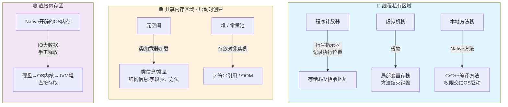

### 堆的内存模型划分

**新生代：**

- **EDN** **新创建的对象都会被存储在这里**---->对象创建过多，EDN满的时候触发minor GC
- 被清除以后剩下的对象会转移到 Survival Space(分为from和to，主要是垃圾回收剩下的类的转移方向，from里面剩下的到to之类)

为什么新生代要划分两个survivor区域

新生代采用的是复制算法，每次清理完之后都需要一片干净的空间来存储回收后剩下的对象，
 下一次回收的时候就交换两个对象的名字

**（适合存储生命周期短的对象，内存空间小）**

**老年代**

- **存储多次minor GC活下来的对象**，生命周期更长，Major GC频率低时间长，**空间更大**

**元空间**

- 本地内存，存储类的字节信息、结构信息（变量字段类型之类的， **不实际存储值**）

**大对象区(不实际存在，针对大对象的一种策略）**

- 对于申请需要 **大片连续的内存空间的对象** 直接分配在老年代
- **避免频繁触发新生代的GC（性能开销）,   避免产生内存碎片，后续的大对象无法分配足够的空间**

------

### 内存泄漏和内存溢出

**内存泄漏**：引用对象一直占用内存空间，导致不能被GC及时回收，最后可用的内存越来越少
 **触发原因：**

- **静态数据结构存储数据**，没有及时删除
- 事件监听（持续对事件源的监听，对象持续引用）
- 未停止线程持有对象引用，没有回收对象（ThreadLocal的滥用）

**内存溢出：** 想要申请大片的内存空间，没有足够的空间，引发OOM导致进程崩溃
 **触发原因**:

- 深度递归调用、大量对象创建、大型数据结构没有及时删除（持续占用内存）

**内存泄漏是因，内存溢出是果**

**常见的溢出**

- 堆溢出(申请大空间）`（OutOfMemory)`
- 栈溢出（递归过多）`(stackOverFlow)`
- 元空间溢出(加载大量的类信息，**动态产生的类信息过多**)

------

### 怎么解决堆溢出的问题

**排查思路:**

- 发生OOM的时候生成快照文件
- 使用MAT工具/JProfiler分析快照文件、分析堆溢出来源

**不同情况来排查：**

- **内存泄漏**：长生命周期引用持有短周期引用、缓存未及时清除
  - 梳理引用链，及时删除不必要的数据
- **内存不足**：申请大空间内存
  - 设置JVM参数，扩大堆内存空间

代码层面:避免一次加载全部数据（分批处理）、缓存设置合理的TTL

------

### 怎么解决栈溢出的问题

**排查思路**

- **是否产生了无限递归**，没有设置正确的递归结束条件----修正终止条件
- **是否递归层级过深**------修改递归逻辑，改递归为迭代
- **是否单个局部变量占用的内存过大**、创建多个局部变量**------在堆内存里面创建对象
- ~~不建议使用的扩大栈帧内存，会导致创建的线程数量变少~~

------

### 内存泄漏和内存溢出的具体例子

**频繁创建静态变量、一个静态变量的存储数据过多**

- `static`修饰的list，存储大量数据，未及时删除，GC也不会主动回收
- 减少静态变量、**单例模式（懒汉加载）**

**未关闭的连接：**

- 数据库连接池、session对象之类的
- finally最后一定要关闭连接

**ThreadLocal的强引用：**

Thread(ref)----->Thread---->ThreadLocalMap(映射表)----->key-value

key是threadlocal的实例对象，value是实际存储的object对象

**key是一个弱引用对象，外部没有强引用关联，key会被回收**，就导致了其中一个entry变成null-object,并且也无法访问到value值

还是会存在强引用链无法回收：Thread(ref)----->Thread---->ThreadLocalMap(映射表)----->value
 **finally最后及时关闭清楚`remove`掉对应得value**

------

### 3. 四大引用类型横向对比与防坑指南

| 引用类型   | 对应的 Java 类                        | GC 存活条件                  | `get()` 是否能获取对象？ | 常见业务场景                                         | ⚠️ 新手易踩坑误区                                             |
| ---------- | ------------------------------------- | ---------------------------- | ------------------------ | ---------------------------------------------------- | ------------------------------------------------------------ |
| **强引用** | 默认直接赋值，直接的new对象           | **GC Roots 可达时不回收**    | 能                       | 99% 的日常对象创建                                   | 将生命周期短的对象放入长生命周期的集合中，引发内存泄漏。     |
| **软引用** | `SoftReference`适用于有用非必须的对象 | **内存不足（OOM 前夕）回收** | 能（被回收前）           | 大对象的本地缓存（如图片、报表数据）                 | 误将 `SoftReference` 当作专业的本地缓存替代品。在实际工程中，更推荐使用带有 LRU 淘汰策略的 Caffeine/Guava Cache。 |
| **弱引用** | `WeakReference`                       | **只要发生 GC 必被回收**     | 能（被回收前）           | `ThreadLocal`、`WeakHashMap`（用于映射临时关联数据） | 误以为只要用了 `ThreadLocal` 就绝对安全，实际上 Value 依然是强引用，必须在 `finally` 块中手动 `remove()`。 |
| **虚引用** | `PhantomReference`                    | **形同虚设，随时被回收**     | **永远返回 `null`**      | NIO 堆外内存管理（`Cleaner` 机制）                   | 试图用它去拯救即将被回收的对象。它不可见，仅作销毁后的消息通知。 |

- 四大引用类型的 **GC回收时机不同**，从上往下触发的条件越来越容易

**弱引用类型**

- **缓存系统实现**，弱引用在OOM前夕时会触发GC，然后对于缓存大小更加容易管理，会在到达内存阈值/其他任务需要更多内存时，JVM自动管理释放
- **对象池、避免内存泄漏**，原理都是当对象都被引用/强引用时，JVM会触发GC

> 其实适合做缓存系统的是软引用，弱引用往往会因为GC频繁触发导致缓存命中率低

**内存回收时缓存对象情况，再次获取缓存对象返回null**

## 核心要点

| 内存区域            | 说明       | 存储内容                          |
| ------------------- | ---------- | --------------------------------- |
| **程序计数器**      | 线程私有   | 当前线程执行的字节码行号指示器    |
| **虚拟机栈**        | 线程私有   | 栈帧，局部变量存栈，方法结束销毁  |
| **本地方法栈**      | 线程私有   | 执行Native方法的空间（C/C++编译） |
| **元空间(方法区）** | 共享       | 类信息、常量、结构信息            |
| **堆/常量池**       | 共享       | 对象实例、字符串引用、静态变量    |
| **直接内存**        | Native管理 | IO大量数据，手工释放              |
|                     |            |                                   |

> 原则：局部变量存**栈**，实例变量（含具体值）存**堆**，元空间存**描述信息**

**程序计数器各个线程私有**

- CPU上下文切换，一个线程的时间片轮完之后，需要保存自己的运行状态和信息，下一次调度时继续上一次未执行的地方，继续向下执行
- **各个线程的执行情况不同**

**堆和方法区都有常量池：**

- 堆里面是JVM唯一的字符串常量池（**存的是引用对象**）

- 方法区里面是各个类和接口的常量---

  运行时常量池：字面量、符号引用等

  - 静态变量随着类加载而加载
  - 方法的字节码文件

**什么是符号引用：**

- 在编译阶段，存储在class常量池的，**对于类的相关信息的逻辑描述**（包括：字段的修饰符、类的名称等）
- 在运行阶段，会将符号引用替换为直接引用（内存地址），来找到对象引用位置 **（解析）**
- 不写死对象引用，**支持多态的实现**

------

## 栈和堆对比总结

| 特性         | 栈 Stack             | 堆 Heap             |
| ------------ | -------------------- | ------------------- |
| **存储内容** | 局部变量、方法参数   | 对象实例            |
| **生命周期** | 明确，方法结束即销毁 | 不明确，GC回收      |
| **存储速度** | 快，LIFO原则         | 较慢                |
| **存储空间** | 较小、固定           | 较大、动态变化      |
| **主要风险** | 递归过深→栈溢出      | 未及时回收→内存泄漏 |
| **回收机制** | 自动（方法返回）     | GC分代回收          |

------

### 方法区的方法调用过程

- **方法解析调用**：引用对象地址--->堆空间查找方法地址---->到元空间查找方法 的结构信息和字节码信息
- **创建栈帧**，包括局部变量表等
- 执行方法，字节码文件，涉及多个操作：局部变量的读写之类的
- 处理返回，当前栈帧移除

**垃圾回收** ：自动检测和回收 **不在被引用的对象的** 机制，减少 内存泄漏和内存溢出的可能性，管理内存的功能

**触发时机**：

- **内存不足**，无法在为新的对象分配内存，自动触发GC机制
- **手动请求**，`system.gc()` 建议JVM触发GC，不会立刻执行
- **设置JVM参数**，设置最大的堆大小和初始大小
- **对象的数量/内存达到阈值**，内部会监控情况来判断时机触发gc

**判断垃圾的方法：**

- **引用计数法**：计数机制，被引用一次+1，解除引用-1，变为0是为垃圾
  - **缺点**
  - 两个对象相互引用，但是外界又没有引用这两个对象的，计数始终为1，无法回收
- **可达性分析算法：** GCROOT（垃圾收集根）向下延展引用的对象，以及object引用的其他对象，
   引用不到/延展不到的对象就是垃圾，（**没有其他对象和他相连**）

注意可以作为GC ROOT的对象

### 垃圾回收算法

先判断是否为垃圾---垃圾回收算法

**标记-清除：**

- 标记所有的可回收对象，统一清除
  - 产生大量的 **内存碎片** ，后来的对象申请大片空间缺乏连续的内存分配
  - 效率不高

**标记整理：**

- 标记所有的可回收对象，

  存活对象移动到另一端

  ，其余的清楚

  - 不会产生内存碎片，**移动对象影响效率**

**复制：**

- 一块空间分为两半，存对象只用其中的一块，垃圾回收 标记存活的后，迁移到另一半，在清楚原来的那一半
- **内存利用率低**

**分代回收算法**

- 根据经历的GC次数，生命周期来划分
- 新生代经过的GC次数到达一定阈值，迁移到老年代

剩下的垃圾回收器看小林coding，不记了，太散了

### **创建对象的过程**

- **类加载检查**，先去常量池里面查看是否有对应的**符号引用**，就是有没有加载过这个类，没有的话就执行类加载
- **分配内存空间**，在堆里面划分确定大小的一部分
- **初始化为零值**，类似变量赋予默认值，防止用的时候为null
- **进行必要的设置**，对象头的信息设置：类的归属、对象的哈希码等，还有锁的部分的设置
- **构造函数初始化**，只是赋予变量初始值还不够，需要按照构造方法对其他的资源初始化

### 对象的生命周期

**创建**(堆里面创建实例、初始化、构造方法)-----**使用**（方法调用等）-----**销毁**(检测刀不在被引用的时候被回收)

### 类加载器

- **启动类加载器(`bootstrap class loader)`** :C++编写，负责加载java的核心库
- **扩展类加载器**：java实现，加载扩展目录下的类，父类是启动类由他加载
- **系统类加载器：** 加载用户类路径下的类，自己编写的类就是这个加载，父类是扩展
- **自定义类加载器：** 用户自定义，可从网络、加密文件等加载类，扩展性高

具有层级关系，从上往下依次继承

### 双亲委派机制

当一个类要被加载的时候，当前的子类加载器不会自己加载，而是交给自己的父类加载器来加载，逐级向上传递，父类不能加载，自己才会加载

**作用**：

- **保证类的唯一性**，确保一个类文件不会被不同的类加载器加载，确保一些核心文件的唯一性和不会被覆盖
- **类的可复用性：** 类被父类加载器加载过一次，其他的所有子类加载器都可以共享
- **保证安全性** ：启动类只会加载信任路径下的类文件信息，对于其他的假冒的不会加载
- **支持隔离和层次划分** 不同的类加载器负责加载不同的类信息，职责清晰，利于维护和扩展
- **简化类的加载流程**：不是每个类都堆积，而是分配不同的任务对象，提高效率

### 类加载的流程

**类加载**：类加载器是一个搬运的过程，把相应类的二进制信息转化为方法区内的 **类的结构信息**
 内存空间里面加载对应的类对象文件
 **连接**：

- **验证**，校验类文件的字节流文件的安全性，不会危害到虚拟机，包括:文件类型、元数据的等
- **准备** ，静态变量分配内存，赋予默认初始值，**只是针对静态变量，其他非静态的实例变量放在创建对象的过程中的也有一个赋予默认值的**
- **解析**，替换符号引用为直接引用（真正的内存地址信息）

**初始化** ： 编译器生成的构造方法，**静态代码块**

**使用**

**卸载**：

- 类的所有实例被回收
- 类的类加载器被卸载（前提关系，最难实现）
- class文件没有被使用、引用

 注意类回收（GC）和类卸载不一样

### ThreadLocal 存储多个线程的数据

**每个线程**的变量都有自己的**独立的存储空间**，相当于一个大的容器开辟很多小格子

一个用途就是对于**多个方法在同一个线程都要用到的局部变量**可以进行存储，要用到的时候直接取出来

id不同的用户会开启不同的线程，在方法调用的时候就是访问不同空间的数据

### 底层结构

映射关系:
 thread--threadloaclmap---entry--key

这个哈希表的key是threadlocal对象，value是object对象（真正要存储的数据）

对于key设置为 **弱引用类型**，value设置成  **强引用类型**

**为什么对于key设置为弱引用类型？**

- 外部切断对threadlocal的引用
- 内部线程不死亡，一直会引用着key值，无法被GC回收，会导致内存泄漏
- 设置为弱引用，会及时被GC回收

**value的内存泄漏问题？**

- tomcat的线程池复用机制，当前的线程基本上会一直存活，thread--threadloaclmap---entry--value这个 **长周期占用短周期的引用一直存在**，无法GC回收
- **==需要及时清除数据（finally里面remove），不然会一直停留，造成内存泄漏 ==**

